<!-- ═══════════════════════════ HEADER ═══════════════════════════ -->
<div align="center">
  
</div>

<br>

<div align="center">

[](https://github.com/siddhantbhattarai)


</div>

<br>

<!-- ═══════════════════════════ ABOUT ═══════════════════════════ -->
## 👋 &nbsp;About Me

I'm a **DevSecOps Engineer and Cloud Security Architect** with experience designing secure
cloud infrastructure, automating software delivery pipelines, and developing offensive
security tooling.

I help organizations build scalable, resilient, and security-first environments across
**AWS, Azure, Kubernetes, Linux, and Windows Server** infrastructures — and I teach the same
material to engineers moving into cloud and security roles.

<div align="center">


</div>

<div align="center">
  
</div>

---

<!-- ═══════════════════════ FLAGSHIP PROJECT ═══════════════════════ -->
<h2 align="center">⚒️ &nbsp;ANVIL — Adversarial Security Testing Framework</h2>

<div align="center">


</div>

A scanner built on one principle: **every finding ships with evidence.** ANVIL detects and safely
proves SQL injection across seven techniques, plus XSS, SSRF, command injection, SSTI, XXE, path
traversal, NoSQL injection, CORS misconfiguration, open redirect and CRLF — backed by passive
audits for security headers, JWT weaknesses, exposed secrets, outdated components and SRI.

```bash
# One-shot OWASP sweep, gated for CI — exit 2 if anything High or worse lands
anvil -t "https://target.com" --owasp --crawl --fail-on high --format json

# Run as an MCP server so AI agents can call it as a native tool
anvil --mcp
```

<table align="center">
<tr>
<td width="33%" align="center">
<h3>🎯 Evidence-driven</h3>
Findings are <b>proven</b>, not flagged.<br>Low false-positive rate by design.
</td>
<td width="33%" align="center">
<h3>🤖 Agent-native</h3>
Built-in <b>MCP server</b> exposing<br><code>anvil_scan</code> to AI agents.
</td>
<td width="33%" align="center">
<h3>🚦 CI-ready</h3>
Deterministic <code>--fail-on</code> exit codes.<br>Stable JSON schema for triage.
</td>
</tr>
</table>

<div align="center">
<a href="https://github.com/siddhantbhattarai/anvil">

</a>
</div>

---

<!-- ═══════════════════════ SELECTED WORK ═══════════════════════ -->
<h2 align="center">🗂️ &nbsp;Selected Work</h2>

<table align="center">
<tr>
<td width="50%" valign="top">

**☁️ [AWS Cloud Foundational Lab](https://github.com/siddhantbhattarai/AWS-Cloud-Foundational-Lab)**

Hands-on lab track covering core AWS architecture — VPC design, IAM, compute and storage —
built for engineers learning cloud from the ground up.

</td>
<td width="50%" valign="top">

**🐳 [Fullstack PHP on Docker](https://github.com/siddhantbhattarai/Fullstack-PHP-Application-Docker)**

Containerized full-stack deployment: multi-service Compose setup, persistent data, and a
reproducible path from local to production.

</td>
</tr>
<tr>
<td width="50%" valign="top">

**⚡ [Azure Function Demo](https://github.com/siddhantbhattarai/Azure-Function-Demo)**

Serverless workloads on Azure Functions — event-driven design, deployment wiring, and the
operational trade-offs that come with it.

</td>
<td width="50%" valign="top">

**⎈ [Kubernetes Deployment](https://github.com/siddhantbhattarai/kubernetes-Deployment)**

Manifests and patterns for running workloads on Kubernetes, from pods and services through
to scaling.

</td>
</tr>
<tr>
<td width="50%" valign="top">

**🧠 [Py4DS & ML Bootcamp](https://github.com/siddhantbhattarai/Py4DS-ML-Bootcamp)**

A full Python-for-data-science curriculum: data manipulation, visualization, and machine
learning algorithms in runnable notebooks.

</td>
<td width="50%" valign="top">

**🧮 [DSA with Python](https://github.com/siddhantbhattarai/DSA-with-Python)**

Data structures and algorithms taught through code — implementations, exercises, and
complexity analysis.

</td>
</tr>
</table>

<div align="center">
<a href="https://github.com/siddhantbhattarai?tab=repositories">

</a>
</div>

---

<!-- ═══════════════════════ CREDENTIALS ═══════════════════════ -->
<h2 align="center">🎓 &nbsp;Credentials</h2>

<div align="center">


<br><br>


</div>

---

<!-- ═══════════════════════ ARSENAL ═══════════════════════ -->
<h2 align="center">🧰 &nbsp;Arsenal</h2>

<table align="center">
<tr>
<td align="right" width="26%"><b>Security & Offensive</b></td>
<td>   </td>
</tr>
<tr>
<td align="right" width="26%"><b>Cloud</b></td>
<td>  </td>
</tr>
<tr>
<td align="right" width="26%"><b>Infrastructure as Code</b></td>
<td>   </td>
</tr>
<tr>
<td align="right" width="26%"><b>CI/CD</b></td>
<td>   </td>
</tr>
<tr>
<td align="right" width="26%"><b>Languages</b></td>
<td>   </td>
</tr>
<tr>
<td align="right" width="26%"><b>Data & ML</b></td>
<td>    </td>
</tr>
<tr>
<td align="right" width="26%"><b>Backend</b></td>
<td>  </td>
</tr>
</table>

---

<!-- ═══════════════════════ METRICS ═══════════════════════ -->
<h2 align="center">📊 &nbsp;The Numbers</h2>

<div align="center">


<br><br>

<b>ANVIL</b> — live repository signal


<br><br>

<!-- Regenerated daily by .github/workflows/snake.yml -->


</div>

---

<!-- ═══════════════════════ WRITING ═══════════════════════ -->
<h2 align="center">✍️ &nbsp;Writing &amp; Teaching</h2>

<div align="center">

Long-form breakdowns of DevSecOps pipelines, AWS architecture and CI/CD — plus free curriculum
for engineers moving into cloud and security roles.

<a href="https://siddhantbhattarai.hashnode.dev"></a>
<a href="https://www.youtube.com/@siddhantacademy101"></a>

</div>

<!-- BLOG-POST-LIST:START -->
<!-- BLOG-POST-LIST:END -->

---

<!-- ═══════════════════════ CURRENTLY ═══════════════════════ -->
<h2 align="center">🛰️ &nbsp;Currently</h2>

<div align="center">

`Extending ANVIL's detection coverage` &nbsp;·&nbsp; `Deepening agent / MCP integration`
&nbsp;·&nbsp; `Publishing cloud security curriculum`

</div>

---

<!-- ═══════════════════════ CONNECT ═══════════════════════ -->
<h2 align="center">🤝 &nbsp;Let's Build Something Secure</h2>

<div align="center">

<a href="https://www.linkedin.com/in/siddhant-bhattarai-3853ab238"></a>
<a href="https://siddhantbhattarai.hashnode.dev"></a>
<a href="https://www.youtube.com/@siddhantacademy101"></a>
<a href="https://www.instagram.com/siddhantacademy101"></a>

<br><br>

<i>Open to DevSecOps consulting, cloud security architecture, and security tooling collaboration.</i>

</div>


